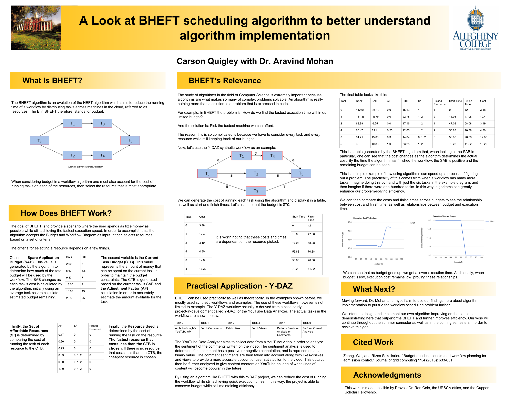

## A Brief Synopsis

During the Summer of 2018 I worked with
[Dr. Aravind Mohan](https://cs.allegheny.edu/sites/amohan/) to deconstruct
algorithms that attempted to solve the well known Scheduling Problem in the realm
of cloud computing. This research led to my presentation of a poster (shown below)
detailing our work towards the end of the research period.

## Scheduling Problem

The scheduling problem in the field of computer science and cloud computing is
a problem in which there are a number of commodity machines in a workflow that
need to be partitioned in order to achieve the highest degree of efficiency.
There are two possible ways of measuring efficiency, namely Cost and Time. We
focused on analyzing the algorithms that attempted to solve the scheduling problem
in terms of cost.

This is the poster we presented on the BHEFT algorithm, which we implemented and
studied to gain a greater understanding of algorithm development.
